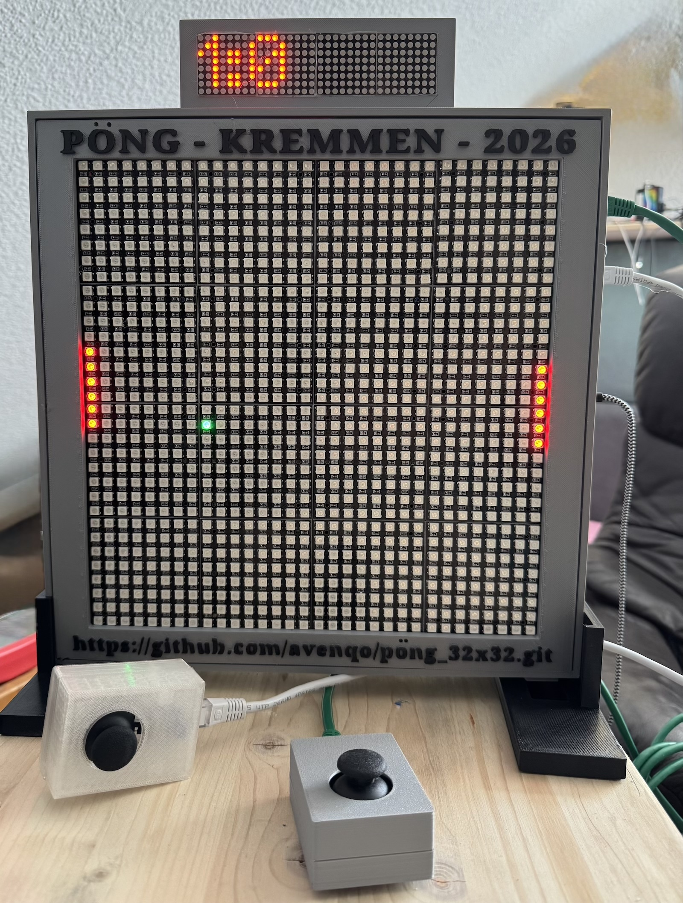

## PöNG 32x32

**PöNG 32x32** is a project that serves as a platform for implementing various games.

The key components include:

- ESP32 controller
- A display based on a 32 × 32 RGB LED matrix,
- Two joysticks for player input,
- Multiple displays,
- A matrix display for showing game status information,
- A 16×2 LCD display with a rotary encoder for navigating the system menu.

Additionally, an SD card reader is integrated, which can be used, for example, to display graphics.

The project consists of documentation for:

- [Hardware](doc/hardware.md),
- 3D models for the [Casing](doc/casing.md) and individual components,
- The actual [Software](doc/software.md), as well as several smaller test programs.

Inspired by the classic game Pong, I implemented a similar game to demonstrate the capabilities of the platform - **PöNG 32x32**.

### Game Operating Instructions

After power-on the device shows a short `START` splash and then runs in
*demo mode*: both paddles are controlled by the built-in AI, so the machine
plays against itself.

Switch between demo and a real match with the rotary encoder:

- turn the encoder while the menu shows `Mode`, or
- give the encoder a medium press (about a second).

Turning back to `Mode` (or another medium press) ends the match and returns to
demo mode. Holding the encoder long **twice within 4 seconds** restarts the
device (the first long press only shows a confirmation).

The system menu is opened with a short encoder press, which cycles through
`Mode`, `Delay`, `Volume`, `Brightness`, `Win at`, `Accel`, `Color`. Turning the
encoder changes the selected value:

- `Delay` – main-loop period in milliseconds (12–120); a smaller value makes the
  whole game faster.
- `Win at` – goals needed to win a match: `3`, `5` or `10` (default `5`).
- `Accel` – how strongly the ball speeds up during a rally: `OFF` or `1`–`3`
  (gentle … strong, default `2`).

### Game Rules

The playfield is the full 32 × 32 matrix. Each player owns one 6‑pixel paddle on
their edge (left / right). The score is shown on the 8‑digit display as
`left:right`.

Every rally runs through the same steps:

1. **Countdown** – `3 · 2 · 1` appears on the matrix, one beep per number. Both
   players may already move their paddles into position.
2. **Serve** – the ball starts near the centre with a random vertical position,
   a random vertical speed and a random left/right direction, together with a
   short "go" sound.
3. **Play**
   - The ball bounces off the top and bottom walls.
   - When it hits a paddle it bounces back; the point of impact sets the new
     vertical angle (near the centre → shallow, near the edge → steep). A dead
     centre hit still gets a slight up or down component, so a rally never locks
     into a purely horizontal exchange.
   - The ball speeds up over the course of a rally – up to about four times the
     serve speed – and drops back to the slow serve speed on the next point. How
     fast it ramps (or whether it ramps at all) is set by the `Accel` menu.
   - The ball always travels a little slower than the paddles and leaves a short
     fading trail.
4. **Goal** – if the ball gets past a paddle and reaches that edge, the opponent
   scores one point. `TOOOR!` is shown briefly, then the next countdown starts.
5. **Match end** – as soon as one side reaches the `Win at` target (3 / 5 / 10,
   default 5) the match is over: a short fanfare plays and a ~6 second victory
   animation runs on the matrix – a gold wipe sweeps in from the winner's edge,
   followed by coloured firework bursts while that edge keeps glowing. A fresh
   match then starts automatically, so demo mode also keeps cycling through
   complete matches with the full celebration.

**Paddle control:** the paddle follows the joystick – the further the stick is
pushed, the faster the paddle moves (up to 3 pixels per frame). In demo mode
both paddles are moved by the AI, which tracks the ball but keeps aiming a few
pixels off centre (re-rolled continuously) and hesitates now and then, so it
returns the ball at varying angles and misses often enough to keep the demo
lively.

A running match can also be abandoned at any time by turning the encoder back to
`Mode` (or a medium press), which returns the device to demo mode.