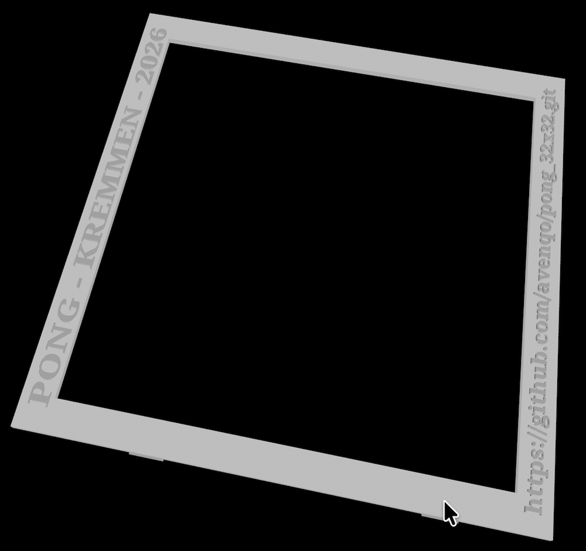
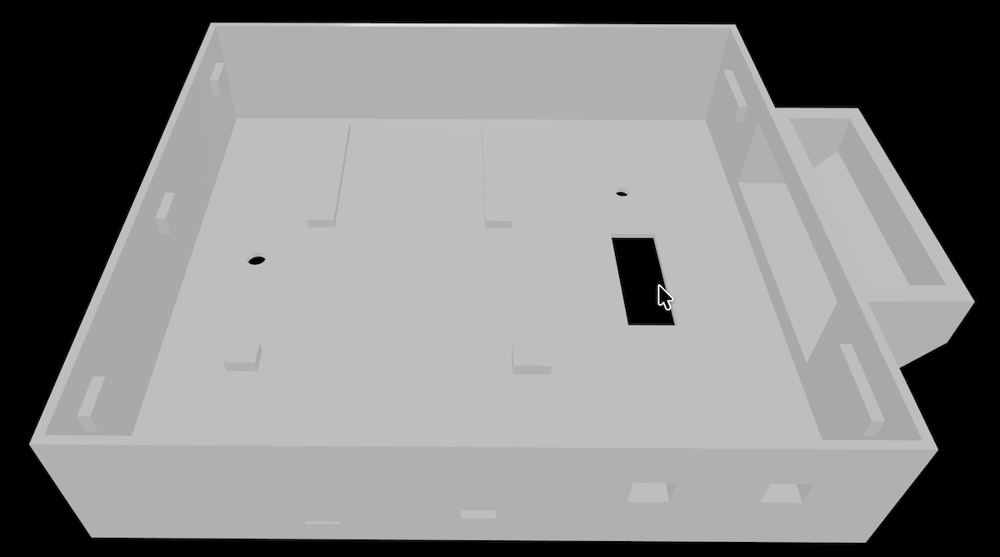
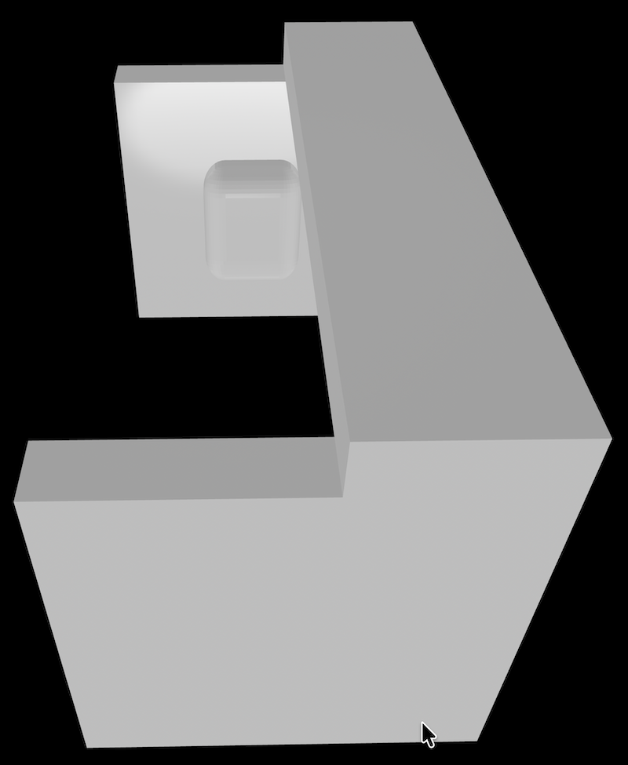
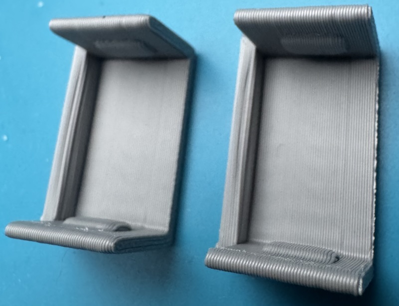
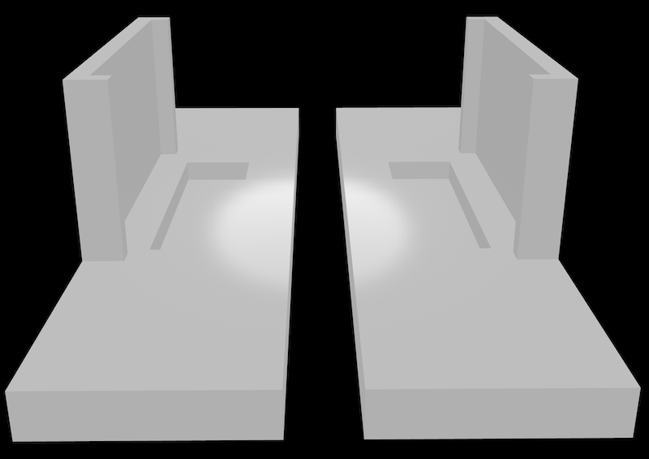
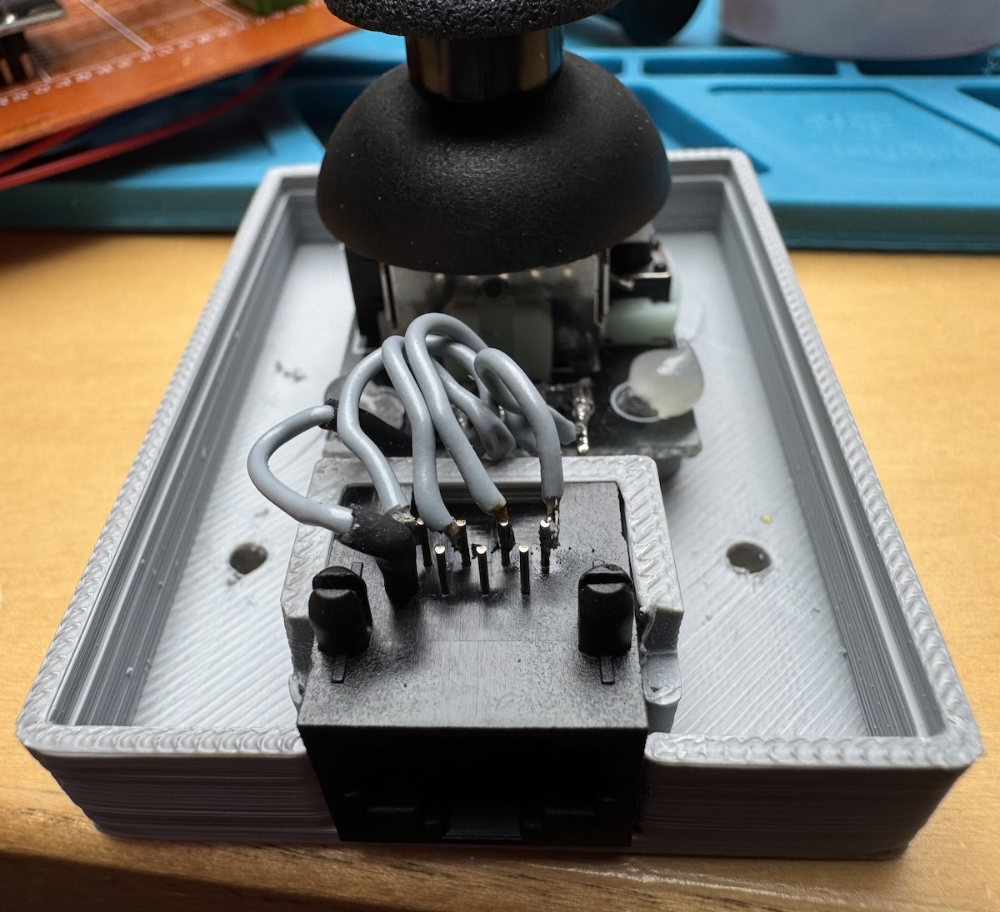
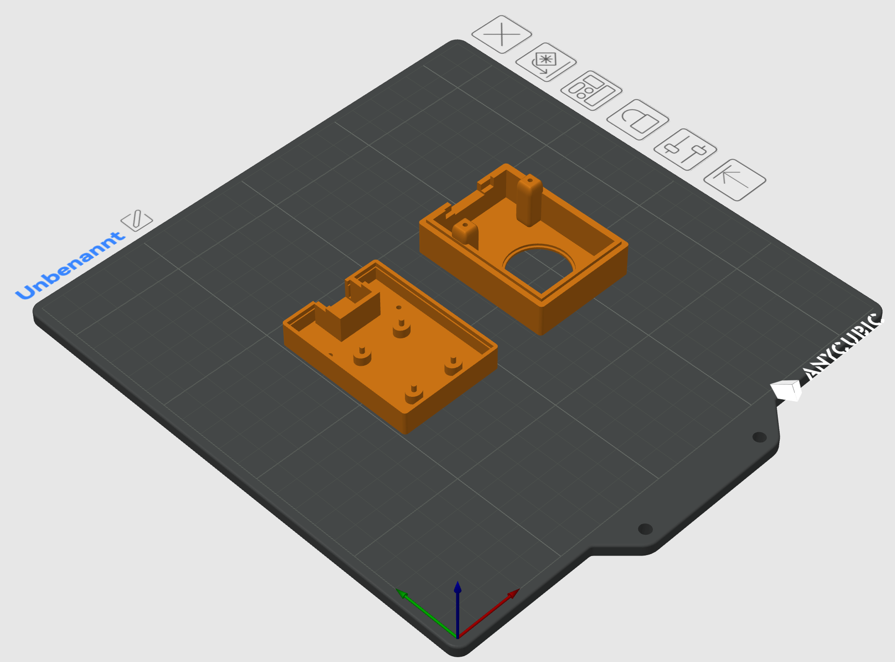

## Casing

The casing consists of several parts. All parts were printed with 15% infill.

I placed the individual 8x8 RGB matrix elements on a flat surface, bonded them together with hot glue, and then reinforced the assembly by gluing a hardboard backing to the rear.
The entire assembly can then be glued into the frame.

### Frame
The frame is positioned inside the casing. 
Here, the LED matrix is ​​bonded—glued into the housing—and screwed in place. When I say "screwed in," I am referring to the use of heat-set inserts, which are embedded into the plastic using a soldering iron.

### Casing
The individual components are screwed or glued into the housing and wired.

### Ethernet Clips
The casing features Ethernet ports to which the joysticks are connected using standard Ethernet patch cables.
Therefore, if you are connecting two joysticks, you will need four of these clips (two inside the main casing, and one inside each of the respective joystick housings).

### Stand
The stand allows the game unit to be set up securely without the risk of tipping over.

### Joysticks
The joysticks are glued into these housings (two are required), and the housings are then screwed shut.

Here, too, a single Ethernet clip is required for each unit to secure the Ethernet jack in place.

