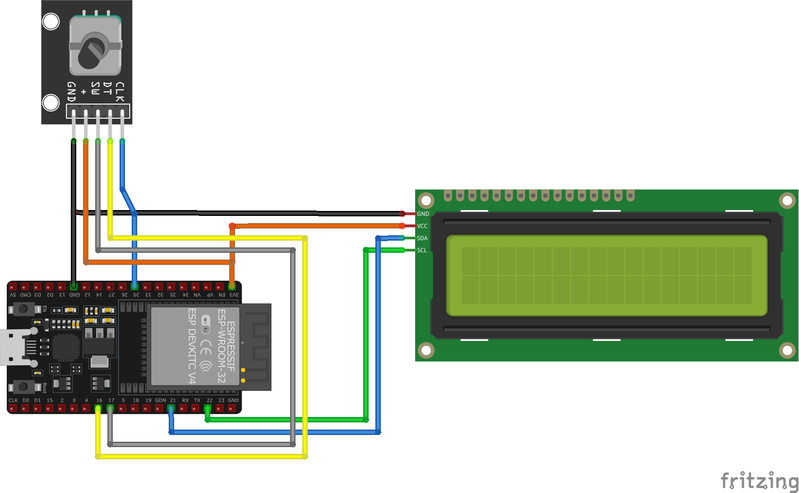
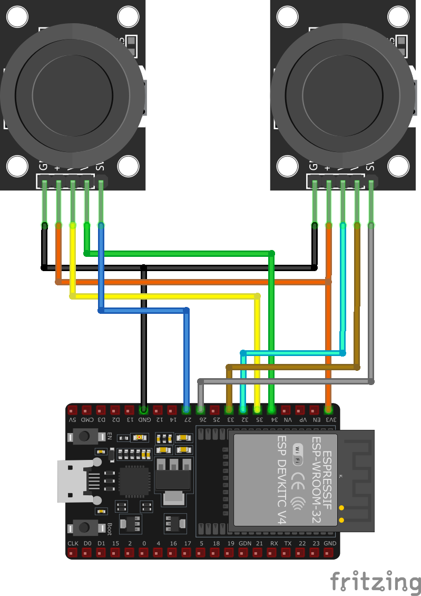
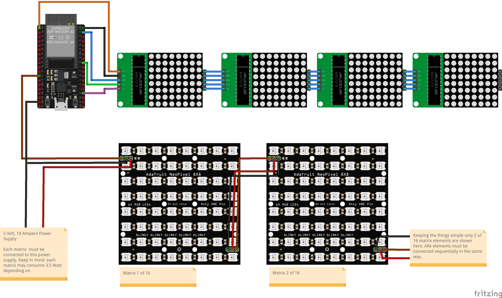
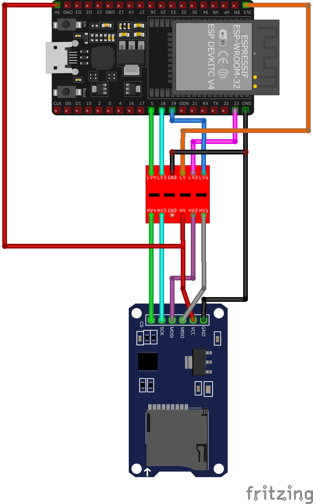

# Hardware Wiring
The hardware is outlined below. Please note that these are **only sketches** showing the correct pin wiring according to the software configuration. 

Plugs, sockets, or other connectors are not depicted.

The power supply is not part of the sketches.

## LCD & Encoder
LCD displays and rotary encoders are used to adjust various settings via a menu, such as playback speed.

It reacts on rotation move (hopping throght the menu options) as well as menu seletion (push knob). 

## Audio (MP3-Player)
The MP3 player is used to generate gameplay sounds. The card inserted in it contains the required audio files. However, mapping the numbers in the code to the corresponding sound files can be tricky. In each case, it must be verified whether the specified numbers actually correspond to the desired sounds.

")

## Joysticks

## LED Matrix
There are two LED matrices: an upper one, which displays the score, for example, and a lower one, which serves as the main screen. For simplicity, the diagram only shows 16 NeoPixel matrix elements as an example. Each of these elements must be connected in series, with the Pin Out of the previous element connected to the Pin In of the next.
Note: It is important to mention that NeoPixel matrix elements have a **relatively high power consumption** of appx. 3,5 Watt per element (when brightnes is set to 100%). Consequently, attention must be paid to the diameter of the power supply wiring. For currents of 10 amperes, a cross-sectional area of at least 1.5 square millimeters is recommended. Furthermore, it is advisable to include a **fuse** in the power supply circuit.

## SD Card
The SD card reader is intended to display animated graphics. However, this feature has not yet been implemented.

